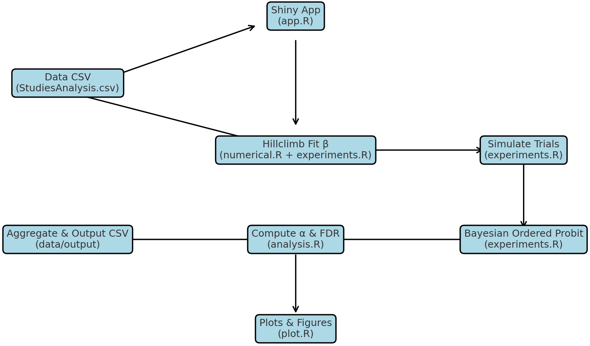

# GP-stats: Spurious Group Polarization Analysis

This project implements the modeling, simulation, and analysis pipeline described in:

> **Turner & Smaldino (2025)**  
> *If the Null Fits, You Must Omit: Ubiquitous False Detections of Group Polarization*

---

## Overview

GP-stats estimates the **false detection rate (FDR)** of group polarization findings by simulating **null-consistent latent opinion distributions** measured on ordinal (Likert) scales. It includes:

- Shiny app (optional) for user-guided parameter fitting
- R scripts for large-N models, hillclimbing, Bayesian ordered-probit fitting, and parallel simulations
- Tools to aggregate and visualize error rates across experiments and studies

---

## Project Structure (current dev guide — cleanup pending)
> **TODO (2025-08-12):** reflects refactor from flat scripts to `scripts/` + `src/`.

```
src/
  util.R        # Libraries + helpers (e.g., load_probit_data)
  fwer.R        # FWER/FDR routines (cohens_d, calculate_fwer); sources util.R

scripts/
  analysis.R          # Aggregation/quantiles for FWER/FDR; sources src/*
  calculations.R      # Runs the full calculation workflow; sources scripts/analysis.R
  plot/
    analysis.R        # Plots from aggregated results (CDFs, etc.); sources src/*, scripts/analysis.R
    model.R           # Plots from simulation outputs; sources root model.R

# root
model.R                # Latent→ordinal mapping & related model utils
experiments.R          # Trial runner: makeBayesianFitTable, singleBayesianFitTrial
bayesian_fit_trial.sh  # Slurm batch script
```

---

## Code ↔ Paper Mapping

| Paper Section | Description | Implementation (current paths) |
|---|---|---|
| **2.2 – How design induces false detections** | Latent→ordinal mapping, thresholds, observed mean (Eq. 2–6) | `model.R` (root) |
| **2.3 – Web app & hillclimbing** | Find σ_pre, σ_post with μ fixed to match empirical means | (if used) `app.R` + solver logic now integrated across `model.R` and `experiments.R` |
| **2.4 – Estimating & limiting FDR** | Simulate trials; ordered probit; compute FWER (α) & FDR (Eq. 7–10) | `experiments.R` (fits) → `src/fwer.R` (FWER) → `scripts/analysis.R` (aggregation) |
| **3.1 – Plausibly spurious detections** | Marking/flagging conditions; inputs to sims | Flags stored in `StudiesAnalysis.csv`; consumed by `experiments.R` / `scripts/analysis.R` |
| **3.2 – FDR distribution** | Quantiles & summary table (Table 1) | `scripts/analysis.R` makes FWER/FDR tables from probit fits made on cluster via `bayesian_fit_trial.sh` that runs slurm job executing `singleBayesianFitTrial()` defined in `experiments.R` |
| **3.3 – Required d\* thresholds** | d\* for FWER ≤ 0.05 | computed from aggregated fits in `scripts/analysis.R` (and plotted in `scripts/plot/analysis.R`) |

---

## Workflow Diagram

The diagram below shows the GP-stats data flow from empirical inputs, through simulations, to statistical outputs and figures.



---

## Data Flow

1. **Load empirical design/data**  
   `data/StudiesAnalysis.csv` → used by `experiments.R` / `scripts/analysis.R`.

2. **Parameter fitting**  
   (optional) Shiny app; otherwise seeded params used for null-consistent trials (μ fixed; σ shrinks).

3. **Simulation & fitting (null)**  
   `experiments.R`: run Bayesian ordered-probit fits per trial → write **UUID-named CSVs** to `data/probit_fits/`.

4. **Aggregation & outputs**  
   `src/util.R`: `load_probit_data()` reads all trial CSVs →  
   `src/fwer.R`: `calculate_fwer()` (FWER at \(d^*\in\{0.2,0.5,0.8\}\)) →  
   `scripts/analysis.R`: assemble tables; derive **FDR** from base-rate & power.

5. **Visualization**  
   `scripts/plot/analysis.R`: CDFs & manuscript figures (FWER/FDR; latent SDs, etc.).  
   `scripts/plot/model.R`: model-level figures using `model.R`.

---


## Requirements

- **R ≥ 4.0**
- Packages: `runjags`, `rjags`, `dplyr`, `tibble`, `parallel`, `uuid`, `shiny`, `readr`, `tidyr`, `fs`, `purrr`
- **JAGS** installed and on PATH

---

## Quick Start

```r
# From repo root:
source("scripts/calculations.R")      # Run full analysis pipeline
source("scripts/plot/analysis.R")     # Generate analysis plots (CDFs, etc.)
source("scripts/plot/model.R")        # Generate model-level plots
```

---


## 🔬 Fitting the Null (batch experiments)

**What this does**  
Bayesian ordered-probit fits for **null-consistent trials** (latent mean held constant; pre→post variance shrinks).

**Driver** (root `experiments.R`)  
- `singleBayesianFitTrial()` → runs one trial; writes **UUID.csv** to `data/probit_fits/`  
- `makeBayesianFitTable(...)` → workhorse called by the single-trial wrapper

**Downstream aggregation**  
- `src/util.R`: `load_probit_data()` reads all UUID CSVs (or a synced `all.csv`)  
- `scripts/analysis.R`: computes FWER per experiment at \(d^*=\{0.2,0.5,0.8\}\), then FDR  
- `scripts/plot/analysis.R`: plots CDFs and figure panels

---

## 🖥 Running Null Fit Experiments on Slurm

**Single trial**
```bash
sbatch bayesian_fit_trial.sh
```

**Job array with concurrency cap** (e.g., 1,000 trials; ≤100 running)
```bash
# 4 CPUs/task × 100 tasks = 400 CPUs ≈ honor-system cap
sbatch --array=1-1000%100 bayesian_fit_trial.sh
```

Each array task runs one independent trial and writes a new UUID CSV.  
**Quick runtime peek**
```bash
tail bayes_fits.out
# or, if accounting is enabled:
# sacct -j <jobid> --format=JobID,JobName,Elapsed,Start,End
```

---

## License

Creative Commons Attribution 4.0 International (CC BY 4.0)  
You are free to share and adapt this work for any purpose, even commercially, provided that you give appropriate credit to the original authors:

> Turner, M.A. & Smaldino, P.E. (2025). *If the Null Fits, You Must Omit: Ubiquitous False Detections of Group Polarization*.

Full license: https://creativecommons.org/licenses/by/4.0/
